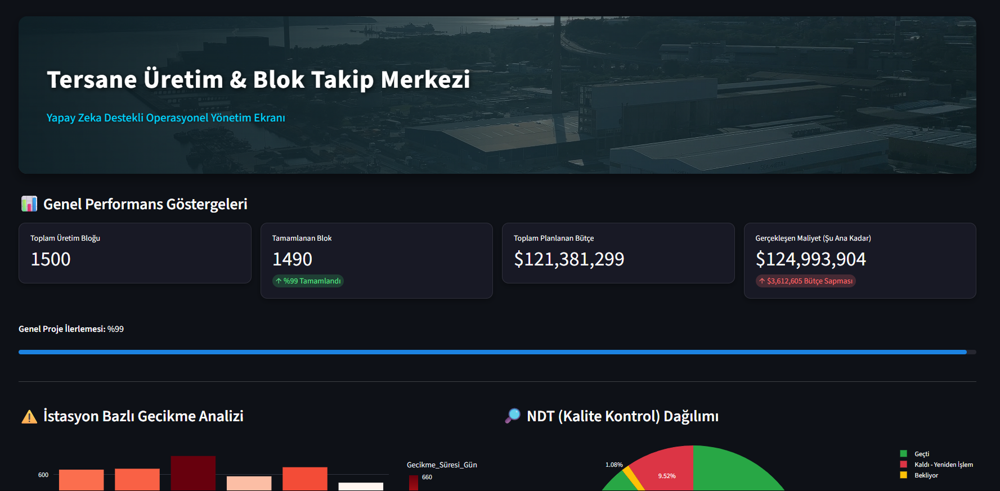

# 🚢 AI-Powered Shipyard Production & Block Tracking System


## 📌 Project Overview
This project is an Enterprise Business Intelligence (BI) application designed to eliminate operational blindness in the shipbuilding industry. Developed as a graduation thesis (YBS421), it transitions traditional spreadsheet-based shipyard block tracking into an agile, AI-integrated executive dashboard.

## 🚀 Key Features
* **Real-Time KPI Tracking:** Dynamic calculation of planned vs. actual budget variances across 1,500 synthetic hull blocks.
* **Interactive Data Visualization:** Station-based delay identification and Non-Destructive Testing (NDT) quality distribution using Plotly Express.
* **Generative AI Integration:** Powered by the **Google Gemini Large Language Model (LLM)**. Shipyard managers can interrogate the production database using Natural Language Processing (NLP) to receive instant root-cause diagnostics and strategic recommendations.

```markdown
### Dashboard Preview


## 🛠️ Technology Stack
* **Backend & ETL:** Python, Pandas
* **Frontend UI:** Streamlit Web Framework
* **Data Visualization:** Plotly Express
* **Artificial Intelligence:** Google Gemini API (Contextual Prompt Engineering)

## ⚙️ Installation & Setup
To run this project locally on your machine, follow these steps:

**1. Clone the repository:**
```bash
git clone [https://github.com/AlperPatan/ai-powered-shipyard-bi-dashboard.git](https://github.com/AlperPatan/ai-powered-shipyard-bi-dashboard.git)
cd ai-powered-shipyard-bi-dashboard
```
**2. Install the required dependencies**
```bash
pip install -r requirements.txt
```
**3. Configure the Gemini API Key:**
* **Create a .streamlit folder in the root directory.**
* **Create a file named secrets.toml inside it.**
* **Add your key:**
```bash
GEMINI_API_KEY = "your_google_gemini_api_key"
```
**4. Run the Dashboard:**
```bash
python -m streamlit run app.py
```

## 👨‍💻 Author
**Alper Patan**, Management Information Systems (MIS)
